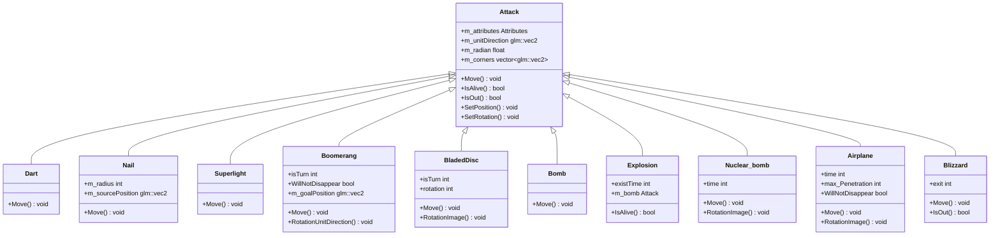

# 國立臺北科技大學 

## 物件導向實習

組別: 5
組員: 

111820023 王品翔
111820033 江子文

復刻遊戲:

# 目錄 

一、專案簡介
1. 遊戲簡介
2. 組別分工

二、遊戲介紹
1. 遊戲規則
2. 遊戲畫面

三、程式設計
1. 程式架構
2. 程式技術

四、結語
1. 問題及解決方法
2. 自評
3. 心得
4. 貢獻比例

# 一、專案簡介 

## 1. 遊戲簡介

BTD5 是一款防塔遊戲，將各式猴子（塔）放到地圖上抵禦氣球的入侵。每隻猴子都有各自的升級分支，衍生出多種不同的防守方式，結合多張地圖及多種屬性敵人，大大提升關卡的多樣性。

## 2. 組別分工

王品翔:
(1) 將猴子放到地圖上(拖移、地圖放置判定)
(2) 猴子的主動及被動技能及猴子技能衍生的Debuff製作
(3) 圖片素材收集
(4) 關卡地圖製作

江子文:
(1) 物件底層架構(猴子、氣球、攻擊...)
(2) 氣球移動、攻擊判定(包含敵人屬性判定)、Debuff 設定
(3) 關卡回合設計、金錢及生命計算、無盡模式實作
(4) 關卡選擇
(5) 升級面板

# 二、遊戲介紹

## 1. 遊戲規則

(1) 大廳關卡選擇(包含 10 個常規關卡(需依序解鎖)及無盡模式)
(2) 進入關卡後可透過拖移猴子至場上，點擊場上猴子可查看升級面板並進行升級或販售（返還 9 成）。每擊破一顆氣球（不論等級）可獲得 1 元；每過一回合亦會依關卡難度獲得金錢。氣球抵達終點會扣 1 滴血（不論等級）。常規關卡共有 10 回合，當回合結束或血量歸零時，系統會跳出選項（進入下一關、重新開始、返回大廳）。此外，右下角設有暫停與加速鍵。
(3) 作弊鍵功能：
   - 在大廳頁面按 `W` 鍵可以解鎖所有關卡
   - 在遊戲進行中按 `W` 鍵可以讓金錢變成無限制

## 2. 遊戲畫面

### (1) 主選單介面

主選單提供關卡選擇功能，玩家可在此選擇不同難度的關卡進行遊戲。

### (2) 關卡選擇介面

關卡選擇畫面展示所有可用關卡，包含常規關卡與無盡模式，玩家需依序解鎖關卡。

### (3) 遊戲進行畫面

遊戲主畫面顯示地圖、已放置的防禦塔以及氣球移動路徑，玩家可透過拖拽方式放置猴子防禦塔。

### (4) 技能系統介面

點擊防禦塔後彈出升級介面，玩家可查看塔的屬性並進行升級或販售操作。

### (5) 遊戲暫停功能

右下角提供暫停與加速控制按鈕，讓玩家可調整遊戲進行節奏。

# 三、程式設計 

## 1. 程式架構

### (1) 整體架構圖

此圖展示了系統的主要父類和它們之間的核心關係，提供整個項目的高層次概覽。

**關鍵組件說明：**

- **GameObject**: 所有遊戲物件的基類，提供位置、繪製和子物件管理
- **Monkey**: 防禦塔基類，負責生產攻擊和管理屬性
- **Attack**: 所有攻擊類型的基類，包含移動和碰撞邏輯
- **Balloon**: 敵人基類，管理生命值和增益效果
- **App**: 主要遊戲控制器，管理所有遊戲物件

### (2) 防禦塔系統架構

展示完整的防禦塔繼承體系，包含12種不同的猴子類型及其特殊功能。

**特殊猴子功能：**

- **Airport & BuccaneerMonkey**: 管理飛機攻擊單位
- **SuperMonkey**: 可以吸收其他猴子獲得能力
- **IceMonkey**: 專門施加冰凍增益效果
- **Cannon**: 發射爆炸性攻擊

### (3) 攻擊系統架構

按功能分組展示40+種攻擊類型，每個分組包含具有相似行為模式的攻擊。

**攻擊類型分組說明：**

- **基礎投射物**: 直線移動的簡單攻擊
- **迴旋攻擊**: 具有返回機制的攻擊
- **爆炸攻擊**: 具有爆炸效果的區域攻擊
- **特殊攻擊**: 具有獨特行為模式的攻擊

### (4) 敵人系統架構

展示敵人類型的完整繼承體系和增益效果系統。

**敵人類型說明：**

- **基礎氣球**: RED, BLUE, GREEN, YELLOW, PINK, BLACK, WHITE
- **高級氣球**: MOAB, BFB, ZOMG, DDT, BAD (具有更高生命值和特殊能力)
- **增益效果**: Snow(減速), Ice(冰凍), Fire(燃燒)等

### (5) 架構設計特點

**設計模式應用：** 

1. **繼承模式**: 使用虛擬函數實現多態行為
2. **組合模式**: GameObject包含Transform和Drawable組件
3. **策略模式**: 不同攻擊類型實現不同的Move()行為

**核心架構特點：**

- **模組化設計**: 清楚分離渲染、遊戲邏輯、UI系統
- **可擴展性**: 易於添加新的猴子、攻擊和敵人類型
- **多態性**: 廣泛使用虛擬函數支持動態行為
- **資源管理**: 使用智能指針管理物件生命週期

**系統統計：**

- **防禦塔類型**: 12種不同的猴子
- **攻擊類型**: 40+種不同的攻擊方式
- **敵人類型**: 12種氣球 + 4種增益效果
- **UI組件**: 完整的遊戲界面系統

## 2. 程式技術

### (1) 分離軸定理(SAT)

用來偵測兩個多邊形（convex polygons）是否發生碰撞。

### (2) 狀態機模式(State Machine Pattern)

用於管理遊戲狀態轉換和複雜攻擊行為的狀態變化，包括應用層狀態（START/UPDATE/END）和攻擊物件的多階段行為控制。

### (3) 參數化數學軌跡運算

實現複雜的運動模式，包括8字形軌跡（使用sin函數組合）、圓形軌道運動和彈道計算，提供豐富的視覺效果。

### (4) 2D座標變換和旋轉矩陣

運用三角函數和矩陣運算實現物件的旋轉、縮放和位移變換，確保碰撞檢測邊界框的精確計算。

### (5) 智能指針記憶體管理

採用現代C++的shared_ptr進行自動記憶體管理，避免記憶體洩漏並實現物件的安全共享。

### (6) 模板程式設計(Template Programming)

使用模板類別實現泛型資源管理系統（如AssetStore<T>），提高程式碼復用性和型別安全。

### (7) 多型和虛函數(Polymorphism)

建立40+種攻擊類型、12種防禦塔和12種敵人的豐富繼承體系，每種類型都實現特定的行為方法。

### (8) 觀察者模式(Observer Pattern)

實現UI系統對遊戲狀態變化的即時響應，以及Debuff效果結束時的連鎖反應機制。

### (9) AABB和精確碰撞檢測系統

結合軸對齊邊界框(AABB)快速篩選和SAT精確碰撞檢測，實現高效能的物理碰撞系統。

### (10) 複雜增益效果系統(Debuff System)

設計多層級的狀態效果管理，支援減速、冰凍、燃燒等16種不同效果的疊加和互動。

### (11) 工廠模式(Factory Pattern)

使用12種不同的按鈕工廠類別動態創建對應的防禦塔物件，實現鬆耦合的物件創建機制。

### (12) 組件式架構(Component-Based Architecture)

採用GameObject基礎類別包含Transform、Drawable等組件，實現模組化和可擴展的遊戲物件系統。

### (13) 策略模式(Strategy Pattern)

不同攻擊類型實現各自的Move()策略，如直線移動、迴旋運動、爆炸擴散等40+種不同行為模式。

### (14) 物理模擬和彈性碰撞

實現邊界反彈、隨機角度偏轉和能量守恆的物理效果，如BladedDisc_Rebound的彈性碰撞機制。

# 四、結語

## 1. 問題及解決方法

### ○ 效能問題 - 函數太長難以維護

**問題：** AppUpdate.cpp中有921行的Update()函數

**解決方法：**

- 統一鼠標位置獲取，減少重複系統調用
- 移除調試代碼和無用註釋  
- 逐步分解大函數成小模組
- 建立optimization_log.md追蹤優化進度

### ○ 關卡平衡問題

**問題：** 遊戲難度曲線不合理，玩家體驗不佳

**解決方法：**
- 重新設計關卡氣球配置
- 前期提供大量低級氣球供玩家賺錢
- 後期溫和提升挑戰難度
- 第十關成為真正的終極挑戰（最高15級）

### ○ 圖片素材不足

**問題：** 原本在某個網站搜尋素材發現不夠

**解決方法：**
- 用英文去搜索角色名稱
- 找到國外的素材網站
- 成功解決素材不夠的問題

### ○ 新功能開發複雜度

**問題：** 冰系攻擊、被動技能等新功能需要整合

**解決方法：**
- 建立完整的Debuff系統
- 新增冰凍氣球效果與顯示
- 更新氣球屬性與減益效果處理邏輯
- 實現各種猴子的被動技能

### ○ 遊戲流程控制

**問題：** 暫停、加速、繼續等功能需要完善

**解決方法：**
- 新增遊戲控制按鈕資源
- 在AppUpdate.cpp中實現流程控制邏輯
- 提供完整的遊戲體驗

### ○ 遊戲地圖區域標記

**問題：** 手動繪製遊戲地圖區域標記太麻煩

**解決方法：**
- 建立 area_marker 項目
- 提供可視化方式標記「不能放的」區域和「水路」區域
- 導出為 glm::vec2 格式的 C++ 代碼
- 支援坐標轉換（以圖片中心為原點）

### ○ 圖片批次處理自動化

**問題：** 大量圖片需要統一處理（旋轉、縮放、重命名）太耗時

**解決方法：**
- 建立 image_processor_main 項目
- 提供批量圖片處理功能
- 支援旋轉、縮放、背景填充、重命名
- 支援顏色吸取功能

### ○ 網頁版圖片編輯工具

**問題：** 需要輕量級的圖片編輯工具

**解決方法：**
- 建立 image_crop_rotate 項目（多邊形裁剪 + 旋轉）
- 建立 imgturn 項目（純旋轉功能）
- 無需安裝，直接在瀏覽器中使用

### ○ 圖片濾鏡效果處理

**問題：** 需要為圖片添加不同顏色濾鏡效果

**解決方法：**
- 建立 color_filter 項目
- 提供 9 種顏色濾鏡選擇
- 可調節濾鏡強度
- 保持透明度

### ○ 圖片智能切割

**問題：** 需要將大圖片切割成小塊

**解決方法：**
- 建立 image_slicer 項目
- 支援拖動式切割線調整
- 自動保存切割後的圖片片段

### ○ Windows 圖標生成

**問題：** 需要將圖片轉換為 Windows ICO 格式

**解決方法：**
- 建立 ico_generator 項目
- 支援多種尺寸的圖標生成
- 保持透明度

### ○ 坐標數據排序

**問題：** 遊戲開發中的坐標數據需要排序整理

**解決方法：**
- 建立 sort_coordinates 項目
- 處理 glm::vec2 格式坐標
- 按從左上到右下順序排序

### ○ 圖片素材管理

**問題：** 需要組織和處理遊戲素材圖片

**解決方法：**
- 建立 monkey 和 monkey_cut 項目
- 存放切片處理後的圖片素材
- 便於遊戲開發使用

## 2. 自評

| 項目 | 預設目標 | 完成情形 |
|:--|:--|:--|
| 防禦塔(包含兩種升級分支及主被動技能) | 預設目標:8種 | 完成12種防禦塔，並盡可能還原遊戲中各塔的主被動特色 |
| 氣球(包含多種屬性) | 預設目標:3種 | 完成氣球加飛船共17種，除了參數還原外，還實做了3種不同屬性，及多種 Debuff 能上到氣球身上 |
| 關卡設計 | 預設目標:6 張地圖、30個關卡 | 完成8張不同地圖，每關10回合，並外加無盡關卡設計 |
| 攻擊 | 預設目標:每種防禦塔各1 | 防禦塔升級後會丟出不同攻擊，加上被動技能後設計約35種不同攻擊，包含不同移動軌跡及效果 |
| 遊戲平衡性調整 | - | 有部分防禦塔的攻擊會常駐在場上，若不限制會破壞平衡，因此經測試後加入適當的穿透值，當該數值歸 0 後無法造成傷害，特定條件後恢復，以調整遊戲平衡 |
| 暫停、加速鍵；作弊鍵 | - | 完成 |
| 遊戲最終測試 | - | 常規關卡可順利進行至結束，無盡關卡至 50 關 |

## 3. 心得

**江子文：** 距離上次寫 OOP 已經快兩年了，因此剛開始在設計程式架構時有點不知所措，對類別如何分工、物件之間的關係一時難以下手。不過隨著專題進行、功能逐步實作，我越來越能體會到 OOP 的價值。透過類別的封裝、繼承與多型，將不同種類的防禦塔、氣球、攻擊邏輯等元素模組化，使整體程式結構變得更清晰，也更容易維護與擴充。這次專題也加深了我對碰撞偵測、座標系統、事件驅動設計等概念的理解，並且學會如何將邏輯與畫面做出有效結合。從剛開始什麼都沒有，到後來逐漸堆疊出完整的遊戲，讓我想起曾經做遊戲的快樂。 

**王品翔：** 為了完成這些專案，我撰寫了許多輔助工具。例如在地圖部分，我設計程式來標示可放置猴子的區域。AI 在此過程中提供了極大的協助，讓我能迅速生成便利工具，進一步提升開發效率。另外，這是我首次透過 GitHub 與他人協作。將專案部署至雲端後，只需簡單推送與拉取即可同步，團隊合作因而更為方便。在整個 OOP 專案中，最具挑戰性的環節是還原各角色技能。雖然過程繁複，但只要專注程式撰寫，最終仍能順利實現。當我看到多樣化的技能在遊戲中呈現時，成就感油然而生。雖然最初未能涵蓋所有功能稍嫌可惜，但看到最後成果仍令我十分滿意。

## 4. 貢獻比例

王品翔：50%
江子文：50%